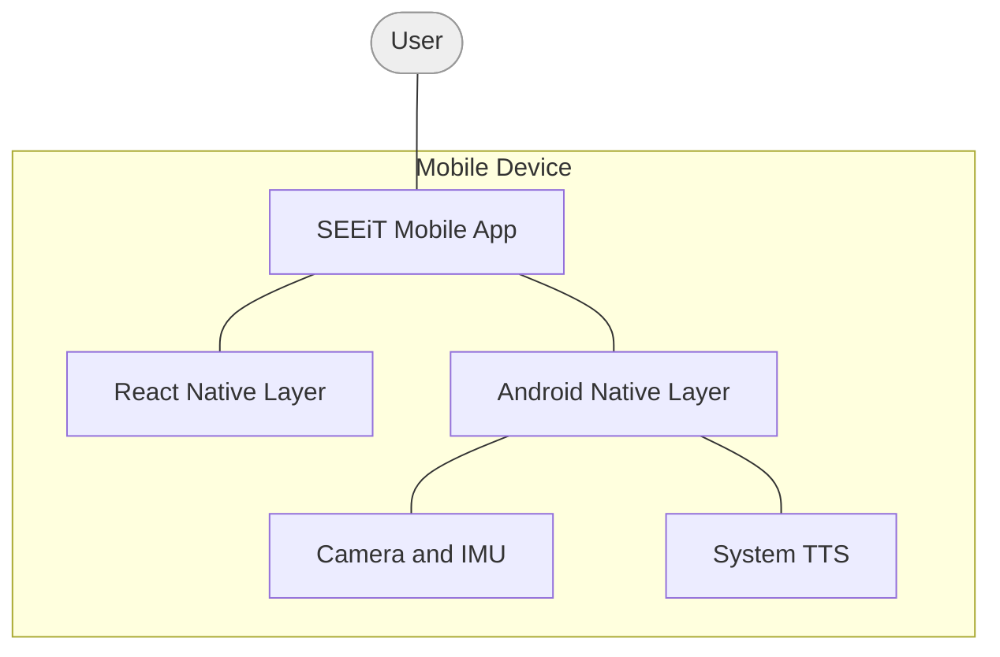
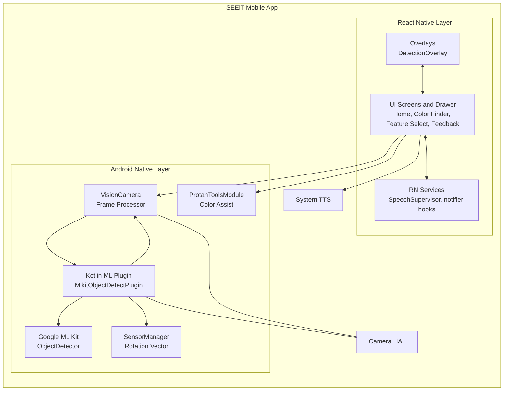
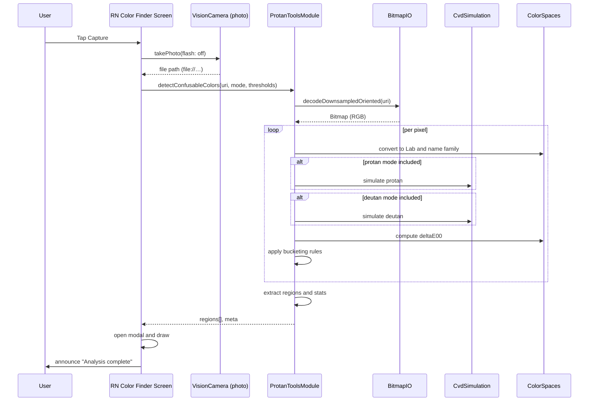
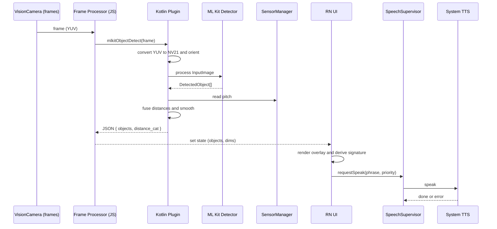

# SEEiT Mobile App — Architecture

A concise, developer-facing view of what runs where and how key flows work.

## C1: System Context

- On-device CV and color assistance (no backend today).
- System TTS; transient files from camera only.

## C2: Container View (App internals)

## C3: Sequence — Color Finder (Capture → Analyze)

## C3: Sequence — Live Detection with Speech

### Notes
- Use ` ` for line breaks inside labels in flowcharts.
- Keep each sequence message on a single line; avoid slashes and arrow symbols in the text to prevent parsing issues on GitHub’s Mermaid.